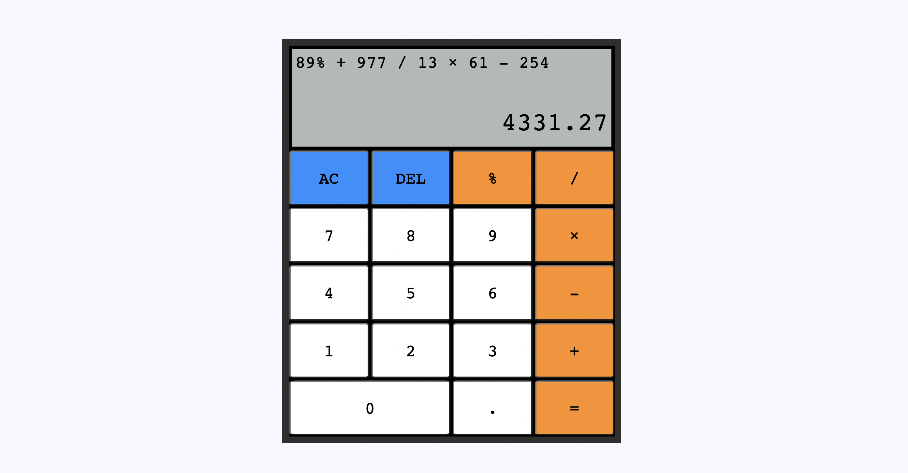

# Calculator

### Features

> Capable of performing simple arithmetic operations.
> All math operations follow BODMAS principle.
> Allows for keyboard and mouse click inputs.
> Returns exponential values for numbers longer than 18 values.
> Returns a maximum of two decimal places for decimal numbers.
## Built With

- JavaScript ES6
- SCSS
- HTML5
## Getting Started 

- Visit [the github page](https://george-swift.github.io/calculator/) to use the calculator
## Show your support

Leave a ⭐️ if you like this project